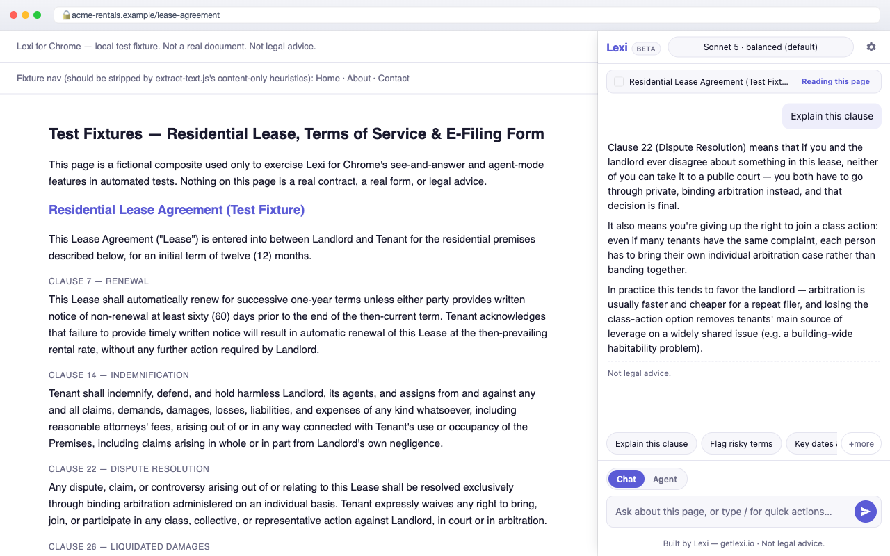
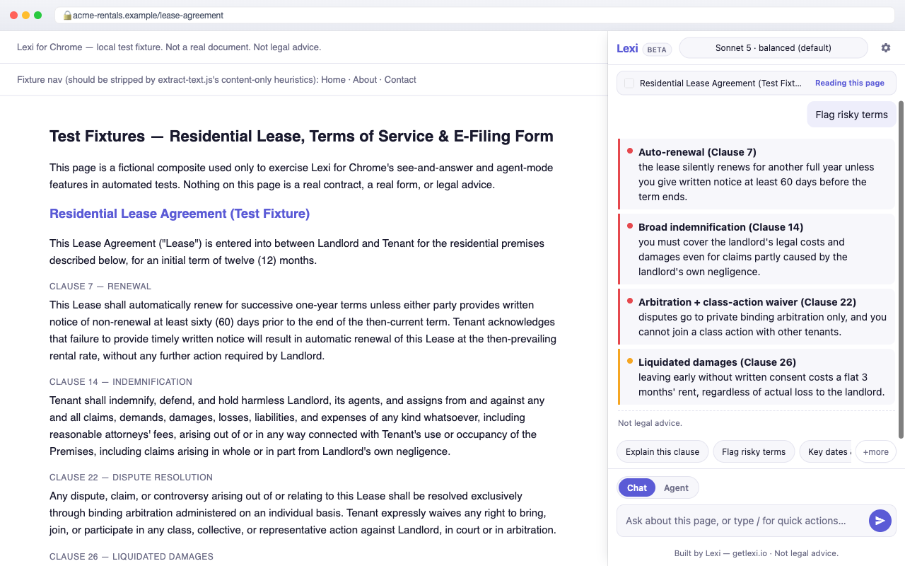
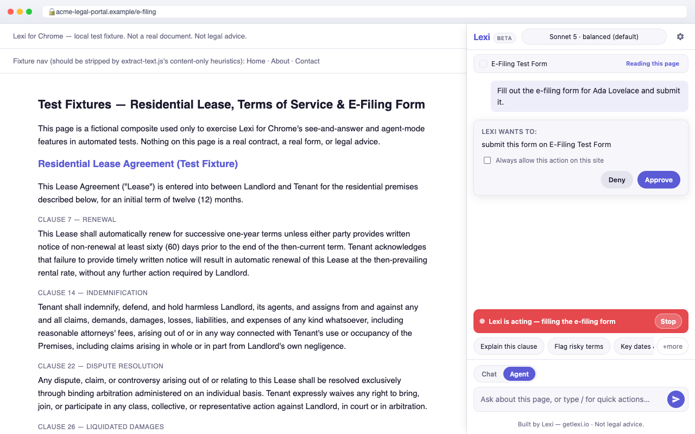
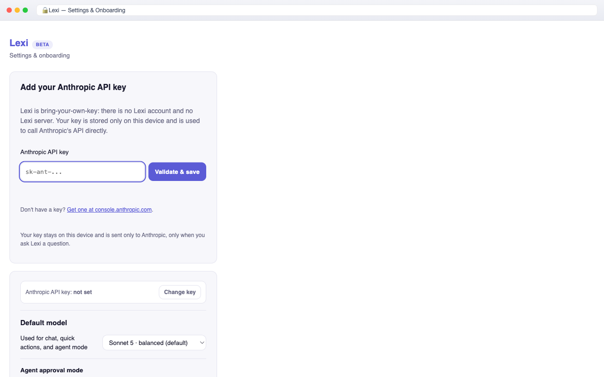

# Lexi for Chrome

**The AI operating system for law, in your browser side panel.** Legal
review, contract analysis, and legal drafting help — explain a clause, flag
risky terms, extract key dates, summarize a judgment, or ask about a
screenshot — grounded in whatever page you're actually looking at. No
account. No Lexi server. Bring your own Anthropic (Claude) API key.

Built by the team at [getlexi.io](https://getlexi.io).

> Lexi is not a law firm and does not provide legal advice. Its output is
> informational only — always confirm anything important with a qualified
> lawyer in your jurisdiction. Lexi is jurisdiction-neutral by default: it
> never assumes a country or legal system unless the page or you say so.

---

## What it is

Lexi lives in Chrome's native side panel (not a popup — it stays open while
you browse and re-anchors to whatever tab is active). Point it at a lease, a
Terms of Service page, an NDA, a court judgment, or an e-filing form and ask:

- **Explain this clause** — plain-English, jargon defined, jurisdiction-neutral.
- **Flag risky terms** — a ranked risk list (auto-renewal, broad indemnity,
  arbitration/class-waiver, unilateral amendment, liquidated damages, …)
  with severity and where each clause appears.
- **Key dates & obligations** — a structured, copyable table.
- **Summarize a judgment or statute** — holding, reasoning, disposition,
  cited authorities (or scope/provisions/definitions for a statute).
- **What am I agreeing to?** — a consumer-friendly bottom line before you
  click "I agree".
- **Screenshot & ask** — capture a chart, table, signature block, or scanned
  exhibit and ask about it directly.

An optional, **off-by-default** Agent Mode lets Lexi click/type/fill forms
on a specific site you explicitly enable it on — see
[Agent Mode & permissions](#agent-mode--permissions) below.

Every answer ends with a **"Not legal advice"** footer.

---

## Install

### From the Chrome Web Store

_(Coming soon — pending review. Until then, use Load unpacked below.)_

### Load unpacked (development)

1. Clone this repo.
2. Open `chrome://extensions` in Chrome (120+).
3. Toggle **Developer mode** on (top right).
4. Click **Load unpacked** and select the repo root (the folder containing
   `manifest.json`).
5. Pin the Lexi icon to your toolbar, click it (or use the side panel picker)
   to open the panel — you'll land on onboarding to add your API key.
6. See the [Icons](#icons) note below — the extension expects
   `icons/icon16.png`, `icon32.png`, `icon48.png`, `icon128.png` to exist at
   the repo root; generate them once with the snippet there if they're
   missing.

No build step. No bundler. No `npm install` required to run the extension
itself — everything is vanilla ES modules loaded directly by the browser.
(`npm install` is only needed for the Playwright e2e tests — see
[Testing](#testing-the-playwright-e2e-suite).)

---

## BYOK setup (bring your own key)

Lexi does not ship a hosted backend and does not proxy your requests through
any Lexi-operated server. You authenticate directly against Anthropic with
your own API key:

1. Get a key at [console.anthropic.com](https://console.anthropic.com)
   (requires an Anthropic account with billing set up).
2. Open the Lexi options page (gear icon in the side panel, or
   `chrome://extensions` → Lexi → **Extension options**).
3. Paste the key into **Add your Anthropic API key** and click **Validate**.
   Validation is a cheap `GET /v1/models` metadata call — it does not spend
   tokens.
4. Pick a default model (Sonnet 5 is the default — see the model picker
   below) and an approval mode for Agent Mode (Manual by default).

**Cost note:** every question you ask sends the page's extracted text (and,
only for "Screenshot & ask", one downscaled image) to Anthropic's API under
*your* key, and Anthropic bills *you* directly per its published token
pricing. Lexi does not mark up, meter, or take a cut of any of this — there
is no Lexi billing at all. To keep costs predictable:

- Text-first design: ~80% of turns never include an image. Screenshots are
  reserved for the dedicated "Screenshot & ask" action and are downscaled to
  ≤1568px long edge before sending (well under Anthropic's high-resolution
  tier) — the panel shows a "~N tokens for 1 image" estimate before you send.
- Extracted page text is capped at ~12,000 tokens (with a `truncated` flag
  if a page is genuinely huge).
- The system prompt is marked `cache_control: ephemeral`, so repeat
  questions on the same page reuse Anthropic's cached-prefix discount
  (`usage.cache_read_input_tokens` in the response).
- Model picker lets you trade cost for depth: **Haiku 4.5** (fast/cheap) →
  **Sonnet 5** (default, balanced) → **Opus 4.8** (deep contract analysis) →
  **Fable 5** (max reasoning for heavy synthesis).

If your machine supports Chrome's built-in on-device model (Gemini Nano —
Chrome 138+, and Chrome's own hardware gate: roughly ≥22GB free disk,
>4GB VRAM, 16GB+ RAM) and you haven't added a Claude key yet, Lexi also
offers a **free, keyless "Basic (on-device)" tier** for lightweight
single-clause explain/summarize (text-only, no vision, no Agent Mode). It's
clearly badged as a basic on-device model with a one-tap nudge to add a
Claude key for anything that needs careful multi-clause analysis. If your
machine doesn't qualify, this tier is hidden entirely and onboarding routes
straight to BYOK.

---

## Privacy promises

See [PRIVACY.md](./PRIVACY.md) for the full plain-language policy. In short:

- **Everything is local.** Your API key, model choice, approval mode, and
  per-site Agent Mode grants live only in `chrome.storage.local` on your
  device.
- **No Lexi servers, ever.** Page content only ever leaves your machine to
  go directly to the AI provider *you* configured, using *your* key.
- **No analytics, no telemetry, no tracking.** Lexi does not phone home.
- **Agent Mode is opt-in, per-site, and reversible.** It is off by default
  everywhere and never touches password or payment fields.

---

## Architecture sketch

Three always-available runtime contexts plus a just-in-time CDP (Chrome
DevTools Protocol) layer, all vanilla ES modules — zero build step.

```
┌─────────────────────────────┐        Port "lexi-sidepanel"        ┌───────────────────────────────┐
│   SIDE PANEL                │◄────────────────────────────────────►│   SERVICE WORKER               │
│   src/sidepanel/*           │  EXTRACT_PAGE / PAGE_CONTENT         │   src/background/*              │
│   src/agent/*                │  CAPTURE_SCREENSHOT / SCREENSHOT_    │   - port registry + heartbeat   │
│   src/prompts/*              │    RESULT                            │   - CDP session (chrome.debugger)│
│                              │  EXEC_TOOL / TOOL_RESULT             │   - screenshot capture           │
│  - chat UI + streaming render│  CONFIRM_REQUIRED / CONFIRM_RESPONSE │   - content-script relay         │
│  - Anthropic SSE client       │  CHECK_SITE_POLICY /                │   - permission-manager           │
│  - agent OBSERVE→PLAN→ACT loop│    SITE_POLICY_RESULT               │   - alarms keepalive (30s)       │
│  - runs the LLM call directly │  REQUEST_AGENT_PERMISSION /          │                                  │
│    (no SW teardown risk)      │    AGENT_PERMISSION_RESULT           │                                  │
└─────────────────────────────┘        GET_SETTINGS / SETTINGS       └───────────────┬─────────────────┘
                                        KEY_VALIDATE / …                              │
                                                                      tabs.sendMessage │  chrome.debugger
                                                                                       ▼                  ▼
                                                                       ┌───────────────────────┐  ┌──────────────────┐
                                                                       │  CONTENT SCRIPTS        │  │  CDP LAYER        │
                                                                       │  src/content/*          │  │  cdp-driver.js +  │
                                                                       │  (injected on demand,    │  │  action-executor  │
                                                                       │   ISOLATED world)        │  │  .js              │
                                                                       │  - extract-text.js       │  │  trusted click/   │
                                                                       │    (Readability-lite)    │  │  type/key events  │
                                                                       │  - dom-index.js          │  │  at CDP-reported  │
                                                                       │    (set-of-marks index)  │  │  bbox coords      │
                                                                       │  - overlay.js (numbered  │  │  (PRIMARY action  │
                                                                       │    boxes + acting bar)   │  │   path in Agent   │
                                                                       │  - content-script.js     │  │   Mode; content-  │
                                                                       │    (message router +     │  │   script synthetic│
                                                                       │    synthetic-action       │  │   events are the  │
                                                                       │    FALLBACK)             │  │   FALLBACK)       │
                                                                       └───────────────────────┘  └──────────────────┘
```

**Message flow, in one line:** Panel talks to the SW over a long-lived Port
(`PORT_NAME = "lexi-sidepanel"`); the SW talks to content scripts via
`chrome.tabs.sendMessage` (`CS_*` messages); Agent Mode actions are
primarily dispatched as trusted CDP input events via `chrome.debugger`, with
content-script synthetic DOM events (`CS_SYNTHETIC_ACTION`) as the fallback
when the debugger isn't attached or is busy. The LLM call itself is made
**from the side panel**, never the service worker — side panels have no
30-second teardown ceiling, so the streaming Anthropic fetch lives where it's
safe to run long.

The complete, authoritative message-type contract (every `MSG.*` constant
above) lives in [`src/config.js`](./src/config.js) — that file is the single
source of truth other modules are built against.

### Agent Mode & permissions

Agent Mode (click/type/scroll/navigate on your behalf) is **off by default
everywhere**. To use it on a site, you explicitly click "Enable agent
actions on this site", which requests the **optional** `debugger` permission
just for that action and stores a per-origin grant. When a task starts,
Lexi attaches a `chrome.debugger` (CDP) session to that one tab — the same
mechanism Claude for Chrome uses — and drives every click, keystroke, and
scroll as **real, trusted native input events** (`isTrusted === true`;
live-verified by the e2e suite's CDP scenario). If the debugger can't
attach (e.g. DevTools is already open on that tab), Lexi degrades to a
synthetic-DOM-event compatibility fallback and says so in the acting bar.
While active:

- A persistent red "Lexi is acting — `<intent>`" bar with a **Stop** button
  sits above the composer, with a control-mode badge ("Controlling tab" =
  trusted CDP input; "Compatibility mode" = synthetic fallback);
  `overlay.js` paints a pulsing red border on the page itself, and Chrome's
  own unsuppressable "started debugging this browser" infobar is present —
  three redundant signals that something is happening.
- Anything in `RISKY_CLASSES` (`SUBMIT`, `NAVIGATE_NEW_DOMAIN`, `PAY`,
  `SEND_MESSAGE`, `UPLOAD`, `DOWNLOAD`, `DELETE`) always pauses for your
  explicit confirmation, regardless of approval mode.
- Typing into password or payment fields, account creation, financial
  transactions, and permanent deletion are **hard-blocked** in every mode —
  the model is instructed to call `ask_user` instead.
- A static denylist (`DENYLIST` in `src/config.js`) hard-blocks Agent Mode
  entirely on financial/banking/checkout, adult, and known
  credential/2FA/identity-provider hosts.
- Closing the side panel, clicking Stop, or cancelling Chrome's own
  debugger infobar are all equivalent — they immediately stop the loop and
  detach the CDP session.

See `permissions.justifications` for the exact per-permission rationale, and
[STORE_LISTING.md](./STORE_LISTING.md) for the Chrome Web Store–facing
version of the same disclosures.

### Base permissions (always requested)

| Permission | Why |
|---|---|
| `sidePanel` | Hosts the entire UI — a side panel page. |
| `activeTab` | Temporary, user-gesture-scoped read access to only the tab you're actively viewing — no persistent all-sites access. Keeps the base install in the CWS fast-review lane. |
| `scripting` | Injects the read-only text/element extraction content scripts into the active tab on user action only — never in the background. |
| `storage` | Your API key, model/approval-mode preferences, and per-site Agent Mode grants — `chrome.storage.local` only, never `sync`. |
| `alarms` | A 30s keepalive ping so the service worker survives a multi-step agent task. No background network activity. |
| `host_permissions: https://api.anthropic.com/*` | Sends your key + the page content you asked about directly to Anthropic. No intermediary server. |

### Optional permissions (requested just-in-time)

| Permission | Why |
|---|---|
| `debugger` | Only requested when you explicitly enable Agent Mode on a specific site — trusted CDP input events for click/type/scroll. Off by default, per-site, revocable. |
| `tabs` | Only requested for "Compare with the other tab" — reads the title/URL of your other open tab. |
| `host_permissions: <all_urls>` (optional) | Only requested together with `debugger` when you enable agent actions on a site whose flow spans multiple pages beyond `activeTab` scope. |

---

## File / build-group map

The codebase was built in parallel build groups against a single spec
(`SPEC.json`); this map is the fastest way to find something.

| Build group | Files | What it covers |
|---|---|---|
| `foundation` | `manifest.json`, `src/config.js` | Manifest + the `MSG`/`MODELS`/`LIMITS`/`STORAGE_KEYS`/`DENYLIST`/`CSS_TOKENS` single source of truth. |
| `service-worker` | `src/background/service-worker.js`, `permission-manager.js` | Port registry, message router, site-policy gate. |
| `cdp-tools` | `src/background/cdp-driver.js`, `action-executor.js` | Chrome DevTools Protocol driver + tool→CDP/fallback mapping with TOCTOU origin re-checks. |
| `agent-core` | `src/agent/anthropic-client.js`, `agent-loop.js`, `tools.js` | Streaming Anthropic client, the OBSERVE→PLAN→ACT loop, tool schemas. |
| `providers-nano` | `src/agent/gemini-nano.js` | Optional keyless on-device (Chrome built-in Prompt API) tier. |
| `content-perception` | `src/content/content-script.js`, `extract-text.js`, `dom-index.js`, `overlay.js` | Classic (non-module) content scripts injected in dependency order: `extract-text.js` → `dom-index.js` → `overlay.js` → `content-script.js`. |
| `sidepanel-ui` | `src/sidepanel/sidepanel.html`, `.css`, `.js`, `chat-render.js` | The panel UI, its controller, and the streaming-safe renderer. |
| `prompts` | `src/prompts/system-prompts.js`, `quick-action-templates.js` | System prompts, the two-sided prompt-injection guard, and the 6 flagship quick-action templates. |
| `options-onboarding` | `src/options/options.html`, `options.js` | Key entry/validation, settings, per-site grant management. |
| `docs` | `README.md`, `STORE_LISTING.md`, `PRIVACY.md` | This file, the CWS listing copy, and the privacy policy. |
| `test-harness` | `test/e2e.spec.js`, `test/test-fixtures.html` | The Playwright end-to-end suite. |

**Important build note (no bundler):** content scripts are injected via
`chrome.scripting.executeScript` as classic scripts, in dependency order —
they cannot use `import`/`export`. Side panel, options, and the service
worker ARE ES modules (`type: "module"`) and use `import`/`export` freely.

---

## Builds

Two Chrome Web Store packages come out of the same source, gated by the
`AGENT_MODE_AVAILABLE` build flag in `src/config.js`:

```bash
scripts/package.sh          # FULL build  → dist/lexi-for-chrome-1.0.0.zip
node scripts/build-lite.mjs # LITE build  → dist/lexi-for-chrome-lite-1.0.0.zip
```

- **`scripts/package.sh` — full build.** Chat + off-by-default, per-site Agent
  Mode. Declares the optional `debugger` / `tabs` / `<all_urls>` permissions
  (requested just-in-time), so CWS reviews it manually.
- **`node scripts/build-lite.mjs` — chat-only lite build.** Stages the source
  with `AGENT_MODE_AVAILABLE` rewritten to `false` (removing every agent-mode
  entry point) and strips the optional permissions from the manifest. No
  `debugger` permission means the fast automated-review lane.

Why two tracks: shipping the lite build first gets the core "see + answer"
product live quickly through fast review, then the full Agent-Mode build
follows as a version update through manual review. See
[STORE_LISTING.md](./STORE_LISTING.md) for the submission order. (`dist/` is
gitignored; verify the lite build in a browser with `scripts/run-lite-e2e.sh`.)

## Testing (the Playwright e2e suite)

```bash
npm install                      # installs @playwright/test once
ANTHROPIC_API_KEY=sk-ant-...  npx playwright test
```

- Tests launch the unpacked extension in a real (headed) Chromium via
  `chromium.launchPersistentContext` with
  `--load-extension=<repo root>` — MV3 extensions require a real browser
  context, not headless-old.
- If `ANTHROPIC_API_KEY` is unset, the suite skips with a clear message
  rather than failing noisily (no key is bundled or required to load the
  extension itself — only to exercise live model calls).
- Three scenarios are covered end-to-end against
  `test/test-fixtures.html`: (A) Q&A / flag-risk on a lease excerpt with
  seeded HIGH-severity clauses, including a hidden prompt-injection string
  to verify the injection guard; (B) Screenshot & ask, asserting an
  `image` content block reaches Anthropic; (C) an agentic click/type task
  on a mock e-filing form, asserting Agent Mode fills a field, respects the
  SUBMIT confirmation gate, and refuses to type into a password field.
- Full scenario detail and pass criteria live in the header comment of
  `test/e2e.spec.js` and in `SPEC.json`'s `test_plan`.

A note on scope: Playwright cannot drive Chrome's *native* side panel
chrome (the panel surface itself), so the suite opens the panel as a direct
`chrome-extension://<id>/src/sidepanel/sidepanel.html?testTabId=...` tab.
This validates all panel logic but not the literal "click the toolbar icon
to open the panel" gesture — that's a one-time manual smoke test.

---

## Icons

`manifest.json` references `icons/icon16.png`, `icon32.png`, `icon48.png`,
and `icon128.png` at the repo root. These are binary assets that can't be
authored as code, so they aren't checked in by the automated build — you (or
a design pass) need to generate them once before `chrome://extensions` will
load the icon (the extension still loads and runs without them; Chrome just
shows a placeholder puzzle-piece icon).

**Intent:** a Lexi violet/indigo (`#5B5BD6` → `#4A3AFF`) rounded-square
background with a simple white "L" monogram (or a minimal scales-of-justice
glyph), transparent corners, at 16/32/48/128px.

**Quick placeholder-generation snippet** (no extra dependencies — uses an
SVG you can rasterize with any tool you have on hand; example below uses
Chrome itself, headless, via a one-off Node script with no npm installs):

```bash
mkdir -p icons
cat > /tmp/lexi-icon.svg <<'EOF'
<svg xmlns="http://www.w3.org/2000/svg" width="128" height="128">
  <defs>
    <linearGradient id="g" x1="0" y1="0" x2="1" y2="1">
      <stop offset="0%" stop-color="#5B5BD6"/>
      <stop offset="100%" stop-color="#4A3AFF"/>
    </linearGradient>
  </defs>
  <rect width="128" height="128" rx="28" fill="url(#g)"/>
  <text x="64" y="90" font-family="-apple-system,Segoe UI,Roboto,sans-serif"
        font-size="72" font-weight="700" fill="#FFFFFF"
        text-anchor="middle">L</text>
</svg>
EOF
# Rasterize at each size with any SVG renderer you have available, e.g.:
#   macOS:   qlmanage -t -s 128 -o icons /tmp/lexi-icon.svg   (then resize down)
#   ImageMagick: magick /tmp/lexi-icon.svg -resize 128x128 icons/icon128.png
#                magick /tmp/lexi-icon.svg -resize 48x48   icons/icon48.png
#                magick /tmp/lexi-icon.svg -resize 32x32   icons/icon32.png
#                magick /tmp/lexi-icon.svg -resize 16x16   icons/icon16.png
#   Or drop the SVG into any online SVG→PNG converter and export all 4 sizes.
```

Any equivalent violet monogram works — this is intentionally low-ceremony
since it's a one-time asset, not something the extension generates at
runtime.

---

## Screenshots

| Q&A grounded in the page | Flag risky terms |
|---|---|
|  |  |

| Agent-mode confirmation | BYOK onboarding |
|---|---|
|  |  |

---

## Links

- Product / company: [getlexi.io](https://getlexi.io)
- Privacy policy: [PRIVACY.md](./PRIVACY.md)
- Chrome Web Store listing copy: [STORE_LISTING.md](./STORE_LISTING.md)
- Get an Anthropic API key: [console.anthropic.com](https://console.anthropic.com)

No secrets are committed to this repository. Your API key lives only in
`chrome.storage.local` on your own machine.
